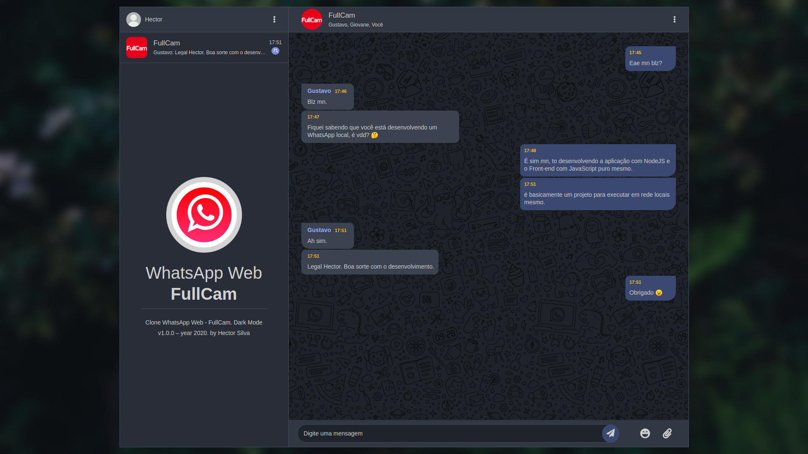
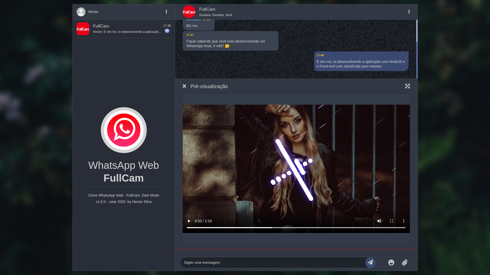
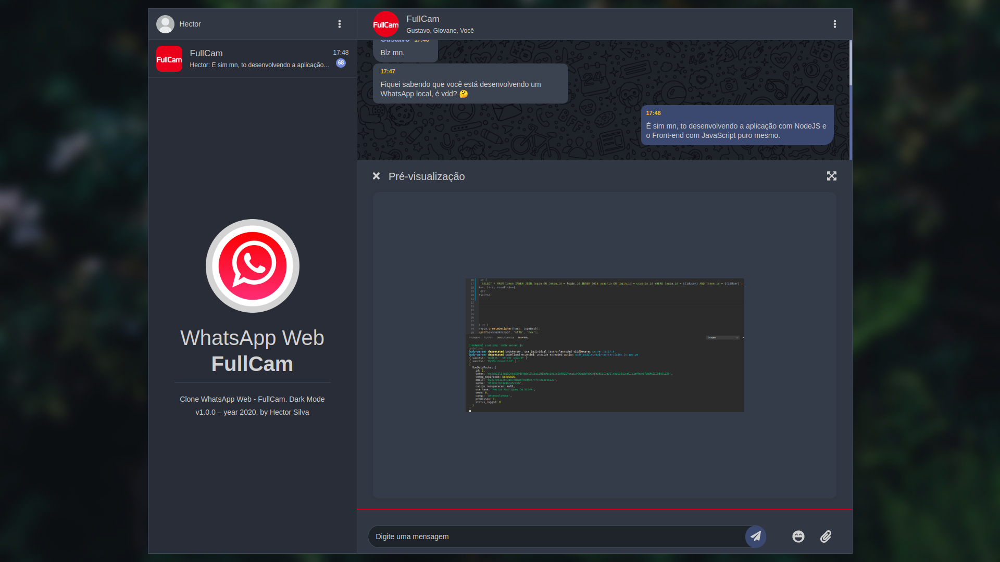

# Clone WhatsApp Web - FullCam. Dark Mode v1.0.0 – year 2020.
• **EM DESENVOLVIMENTO**:

<html>
 <body>
    
    
    
 </body>
</html>

• Project made in **Node.js and Socket.io**:
 - *Hector Silva* (_Web_ developer)

Instalação:

Versão requerida do Node.js:
```
v13.12.0
```

MYSQL
```
Execute o Banco que está no diretório (backend/sql/chat.sql)
```

Instalar dependências:
```
npm i
```
Iniciar projeto com nodemon:
```
npm start
```

Iniciar projeto sem nodemon:
```
node server
```
<!-- 
Instalação pm2 para servidor 24h:
```
npm install pm2 -g
```

Iniciar pm2 e cancelar:
```
pm2 start server.js
pm2 stop server.js
``` -->

executar projeto no navegador
```
localhost:7002
```
